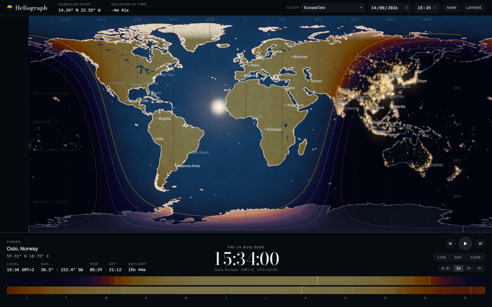
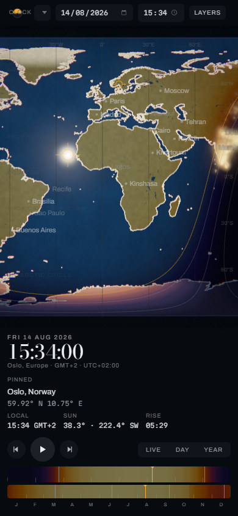

# Heliograph

A world map of sunlight. Where the sun falls on Earth, at any date and time, in
UTC or in local time.



## What you are looking at

Every pixel is coloured by the solar elevation angle at that exact latitude and
longitude. Nothing is a tinted photograph and nothing is a hand-picked gradient:
the colour of a place is what that place looks like from directly overhead with
the sun where it actually is.

The three surface ramps (ocean, land, permanent ice) come from a spectral model
built on published constants, the ASTM G-173 solar spectrum, IUP Bremen ozone
cross sections, Rayleigh and Mie parameters from Bruneton and Neyret, and the
Kasten and Young air mass, cross checked against measured imagery: Apollo 17
AS17-148-22727 for the ocean, NASA Blue Marble for the land, and Patat et al.
2006 twilight photometry for the colour of the sky below the horizon. That is
why the golden hour is gold, why snow goes pink at sunset while water goes
straight to blue, and why every surface converges on the same grey-blue within a
couple of degrees of the terminator: down there the atmosphere is most of what
you can see.

The land is a photograph. Under the illumination sits NASA's Blue Marble Next
Generation: a cloud free monthly composite of MODIS surface reflectance, which
is to say what the ground actually looked like from orbit. That is why the
Sahara is sand rather than a shade meaning "high", why the Amazon and the Congo
are dark forest, and why the Nile is a green thread through a brown desert.
Nothing here is an elevation tint.

The map also knows the season, and knows it from measurement rather than
invention. Two composites are compiled in, the two solstice months, because
between them they carry the whole seasonal swing in both hemispheres at once:
June has a green Siberia and a snowed-in Patagonia, December has the reverse.
The renderer holds June at full resolution and December as the ratio between
them, a smooth low frequency gain, and slides between the two on the Sun's own
declination. So the map needs no calendar: scrub the year and the boreal forest
greens and browns, the snow line walks down into the mid latitudes and back,
and the Sahel dries, all of it as photographed. Bright colourless ground is
recognised as snow and shaded on the ice ramp, so real snowfields go pink at
sunset like snow and not like rock.

Because a lens sees a far wider range than a map can print, the brightness is
compressed about the typical land value while the colour is carried through
intact: dark boreal forest and bright desert are a factor of thirty apart in
the data, and passed straight through, one would be black and the other would
clip.

Over that continuous gradient sit four hairlines, at solar elevations of
-0.833, -6, -12 and -18 degrees: sunrise and sunset, then the ends of civil,
nautical and astronomical twilight. Most maps of this kind pick one or the
other. Discrete bands are legible and look like a diagram; a smooth gradient
looks like a photograph and cannot be read. Drawing both means the hairline at
-6 lands exactly where the colour changes character, which is what shows the
gradient is real.

The rest is instrumentation. The equator, the tropics and the polar circles are
drawn heavier than the other graticule lines because they are the geometry of
the whole subject: the subsolar point runs between the tropics and nowhere else,
and the polar circles are exactly where the sun stops rising and setting.

## Using it

**Set an instant.** Type a date and a time into the rail, drag either scrubber,
or press the arrow keys. The clock selector decides whether that time means UTC
or the wall clock in a particular zone.

**The scrubbers are made of the data.** The upper track is the sky colour at the
pinned place across twenty four hours, so sunrise, the golden hour and the three
twilights are visible as bands inside the control. The lower track is the same
reading across the year, so scrubbing one redraws the other and the bands
breathe with the seasons. The bright ticks are sunrise and sunset on the upper
track, and the solstices and equinoxes on the lower one.

**Animate.** `Live` follows the clock. `Day` sweeps twenty four hours in about
twenty seconds. `Year` runs a full year in about a minute while holding the wall
clock, so the terminator barely moves sideways and instead tilts, and the polar
day and polar night open and close. Space bar plays and pauses.

**Find a place.** Move the pointer over the map for a live readout, or click to
pin one. Press `/` to search 7,342 places and every IANA zone by name; accents
are folded, so Malmo finds Malmö, and the larger place wins a tie, so London is
London and not Londonderry. Scroll to zoom, drag to pan, `0` to reset. Star a
place to keep it.

**The almanac.** Press `A` for everything the arithmetic already knows about the
pinned place: the whole twilight sequence rather than just sunrise, both golden
hours, solar noon, how much longer today is than yesterday, the Moon's phase and
rise and set, and a chart of the daylight across the whole year with today
ruled on it. Somewhere above sixty degrees in summer the first and last light
simply stop happening, and the almanac says so rather than inventing a time.

**The Moon.** Its position follows Meeus chapters 47 and 48 in full, all one
hundred and twenty periodic terms, which holds it to about ten arcseconds. It is
drawn at the point it stands overhead, showing tonight's phase as a real
terminator: a half ellipse, because that is what a great circle on a sphere
looks like from an angle. And it lights the ground. Full moonlight is a quarter
of a lux against daylight's hundred thousand, so it is never more than a
whisper, but it is the reason a clear night with a moon up does not look like
one without. The light is cold because the dark adapted eye is.

**One local time, everywhere.** Normally the map is one instant. Turn on `Local
time everywhere` and every zone is drawn at the same reading of its own clock
instead, so the map answers "how light is it at five in the morning" for the
whole world at once. The zone boundaries become visible steps in the light, and
what the steps show is how far each place sits from the meridian its clock is
keeping. At local noon on a December solstice there is one sun glint per zone,
strung along the Tropic of Capricorn.

**Eclipses.** The almanac lists the eclipses to come, solar and lunar, searched
out of the geometry rather than read from a table, so the horizon is a century
and the limit is patience rather than data. Pick one and the map goes to the
instant of greatest eclipse, where the Moon's shadow is drawn on the ground:
the real umbra and penumbra, worked out per pixel, because the Moon is close
enough that two observers a few hundred kilometres apart see it against
measurably different sky. That is why totality is a track a hundred kilometres
wide and not a hemisphere.

**On a phone.** The map is the whole screen. The rail floats over its top edge
and the console folds into a bottom sheet that peeks the clock and the day
scrubber; pull it up, or tap it, for the rest of the readout, the year scrubber
and the animation controls. The page itself never scrolls or zooms, only the
map does: a phone opens zoomed in on wherever your browser thinks you are,
worked out from your time zone and without asking for location permission. Drag
to pan, pinch to zoom, double tap to zoom in, single tap to pin a place, and
the round button above the sheet brings the view home. There is no hover on a
touch screen, so the readout follows the pin rather than your finger, and every
control is sized for one. Added to a home screen it runs standalone, edge to
edge.

**Time zones.** Turn on the time zone layer to see the real, irregular zone
boundaries with each zone's own clock. Turn on `Same clock time` as well and
every zone currently reading the same wall clock as your chosen one lights up.
That is the quickest way to answer "where in the world is it 13:34 right now".

**Take it with you.** The share button writes a PNG of the map with the instant
captioned on it, through the system share sheet on a phone and as a download
everywhere else. The whole app is precached by a service worker, so once it has
been opened it runs with no network at all, and it installs to a home screen.

Everything is in the address bar, so any view can be linked to:

```
?t=2026-12-01T13:34Z&tz=Europe/Oslo&z=2&lon=10.7&lat=59.9&play=off
```

### Keyboard

| Key | Action |
|---|---|
| Space | Play or pause |
| `/` | Find a place |
| `A` | Almanac |
| Left, Right | Step an hour, or a day with Shift |
| `+`, `-` | Zoom |
| `0` | Reset the view |
| `L` | Layers |



## Accuracy

Solar position follows the NOAA Solar Calculator, which is a condensation of
Meeus chapter 25. Measured against full VSOP87 it holds the declination to 13
arcseconds and the equation of time to 3.4 seconds, and against the US Naval
Observatory the subsolar point is good to 11 arcseconds of latitude and 46
arcseconds of longitude. On a 4096 pixel wide map that is a seventh of a pixel.
UTC is fed in directly with no delta T correction, which costs about one further
arcsecond.

Two places need more care than the obvious implementation gives, and both are
handled:

- **Sunrise and sunset** are found by scanning the solar day every ten minutes
  and bisecting each crossing, not by the fixed point iteration NOAA's own page
  uses. That iteration is not a contraction above roughly 63 degrees of
  latitude: at 70 north it can be twelve minutes out, and running it a third
  time makes it worse rather than better. Reykjavik and Tromso are exactly the
  places anyone looks at first on a map like this.
- **Solstices and equinoxes** use Meeus chapter 27 rather than root finding on
  the low accuracy solar longitude, which is wrong by up to eleven minutes near
  an equinox.

Sunrise and sunset are shown to the minute and not to the second, because above
about 60 degrees of latitude the limiting factor is not the ephemeris, it is the
assumption that refraction lifts the horizon by a standard 34 arcminutes.

Time zone offsets come from the runtime's own IANA database through `Intl`, so
daylight saving is always current and no zone table ships with the app. Wall
clock to UTC conversion follows the Temporal proposal's "compatible" rule: a
time skipped by a spring forward resolves to the first real instant after the
gap, and a time that happens twice in an autumn fall back resolves to the
earlier of the two.

## Running it

```
npm install
npm run dev
```

Then `npm run verify` for the whole check: typecheck, unit tests, production
build, and the browser tests.

| Command | What it does |
|---|---|
| `npm run dev` | Development server |
| `npm run build` | Production build into `dist/` |
| `SINGLEFILE=1 npm run build` | One self-contained HTML file |
| `npm test` | Unit tests |
| `npm run e2e` | Browser tests |
| `npm run data` | Rebuild the map data from Natural Earth |
| `npm run terrain` | Rebuild the land imagery from NASA Blue Marble |
| `npm run fonts` | Re-subset and re-embed the typefaces |
| `npm run deploy` | Build and publish to GitHub Pages |

Nothing is fetched at runtime. The map data, the three typefaces and every
asset are compiled in, so the single file build runs from a local disk or inside
a sandbox with no network at all.

## How it is put together

```
src/solar/      solar position, the Moon, eclipses, sunrise and sunset, the seasons
src/time/       time zone arithmetic, built entirely on Intl
src/data/       the packed world data and the spatial lookups over it
src/render/     WebGL2 renderer, the colour ramps, the vector overlay
src/app/        the shell, the console, the scrubbers
scripts/        the build time data and font pipelines
docs/research/  the sources every number in here came from
```

The scene is composited in linear light into a half float framebuffer and tone
mapped once at the end. Only two things are allowed above 1.0, the sun glint on
the water and the cores of the brightest cities, which is what makes the bloom
mean something. The vector work sits on a separate 2D canvas, deliberately
outside that buffer, because hairlines and type should not bloom.

Land, lakes, coastlines and borders are real geometry rather than a raster, so
they stay sharp at every zoom. The city lights are 7,342 real places from
Natural Earth, sized by the logarithm of their population and dimmed as they
grow so that zooming in does not brighten a continent.

## Credits

Cartography from [Natural Earth](https://www.naturalearthdata.com), which is in
the public domain. Land imagery from NASA's
[Blue Marble Next Generation](https://earthobservatory.nasa.gov/features/BlueMarble),
by Reto Stockli at the NASA Earth Observatory. Type is Bodoni Moda, Archivo and
Martian Mono, all under the SIL Open Font License; see `THIRD-PARTY.md`. The
colour and accuracy work rests on the sources catalogued in `docs/research/`.
